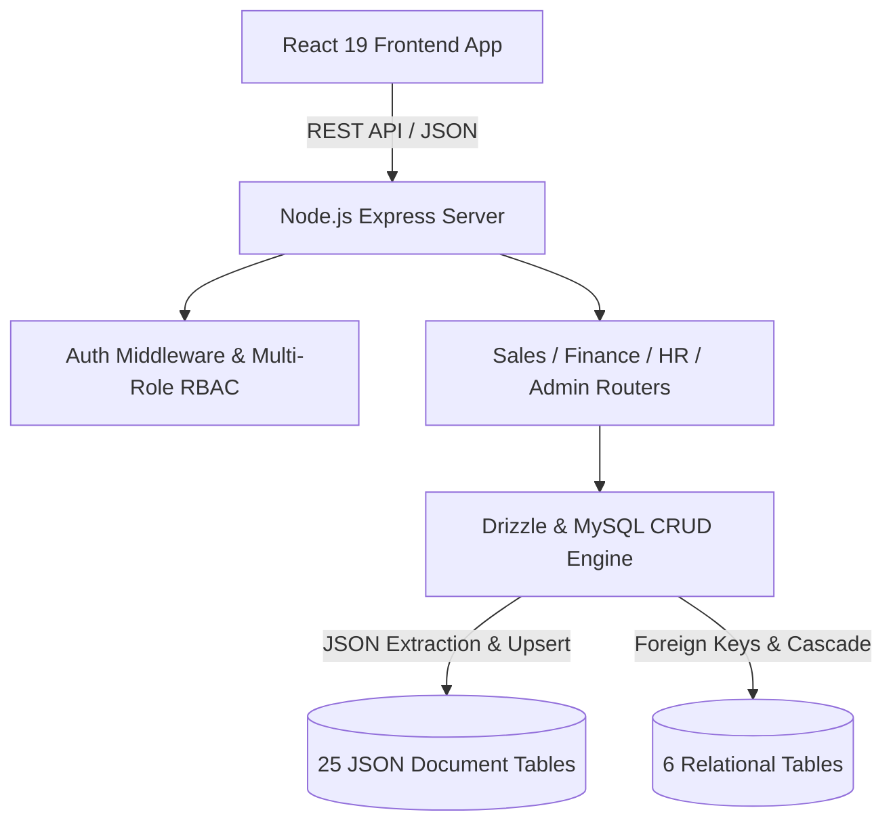

# HKC ERP v4 - MySQL Architecture, Verification & Plesk Deployment Guide

This document provides a comprehensive technical overview of the local and production MySQL database architecture in **HKC ERP v4**, including schema designs, query engine capabilities, business transaction workflows, backup/restore procedures, and step-by-step deployment instructions for **Plesk hosting**.

---

## 📑 Table of Contents

1. [Architecture Overview](#1-architecture-overview)
2. [Master 31-Table Registry & Schema Design](#2-master-31-table-registry--schema-design)
   - [Inventory Module (4 Tables)](#inventory-module-4-tables)
   - [Sales & Purchasing Module (9 Tables)](#sales--purchasing-module-9-tables)
   - [Finance & General Ledger Module (10 Tables)](#finance--general-ledger-module-10-tables)
   - [HR & Payroll Module (6 Tables)](#hr--payroll-module-6-tables)
   - [Admin & Security Module (2 Tables)](#admin--security-module-2-tables)
3. [Connection Management & MySQL Client Engine](#3-connection-management--mysql-client-engine)
4. [Query Engine & JSON Document Extraction](#4-query-engine--json-document-extraction)
5. [Automated Business Transaction Workflows](#5-automated-business-transaction-workflows)
   - [Sales Issue Posting & Double-Entry GL Posting](#sales-issue-posting--double-entry-gl-posting)
   - [Processing Services & Automated Revenue Recognition](#processing-services--automated-revenue-recognition)
   - [HR Statutory Payroll Payment Execution](#hr-statutory-payroll-payment-execution)
   - [Strong Password Hashing & Multi-Role RBAC](#strong-password-hashing--multi-role-rbac)
6. [Backup Snapshots & Zero-Loss Seed Engine](#6-backup-snapshots--zero-loss-seed-engine)
7. [Automated Verification Test Suites](#7-automated-verification-test-suites)
8. [Production Deployment Guide for Plesk Hosting](#8-production-deployment-guide-for-plesk-hosting)

---

## 1. Architecture Overview

HKC ERP v4 employs a high-performance **Hybrid Storage Architecture** tailored for MySQL 8.0+ and MariaDB:

- **JSON Document Tables (25 Tables)**: High flexibility, schema-free entity records with native indexed `id`, `payload` (JSON), `created_at`, and `updated_at`. Enables sub-millisecond document lookups, dynamic schema evolution without disruptive DDL migrations, and full searchability through `JSON_EXTRACT` and `JSON_UNQUOTE`.
- **Relational Normalized Tables (6 Tables)**: Structured relational integrity for mission-critical relational data requiring strict foreign keys, multi-column compound indices, and cascade constraints (`users`, `user_activity_logs`, `sales_issues`, `sales_issue_items`, `processing_services`, `shipment_documents`).



---

## 2. Master 31-Table Registry & Schema Design

All 31 database tables are defined in [`server/db/schema/sql/master_mysql.sql`](file:///Users/menelikalemayehu/Documents/HKC-ERP-V4/server/db/schema/sql/master_mysql.sql) and registered in [`server/db/resourceRegistry.js`](file:///Users/menelikalemayehu/Documents/HKC-ERP-V4/server/db/resourceRegistry.js).

### Inventory Module (4 Tables)
| Table Name | Storage Type | Description |
| :--- | :--- | :--- |
| `warehouses` | JSON Document | Storage hubs (WH1 Export Hub, WH2 Veterinary India, WH3 Veterinary China). |
| `inventory_products` | JSON Document | Product catalog, multi-warehouse stock breakdown, batches, FIFO entries. |
| `stock_movements` | JSON Document | Audit ledger of inventory receipts, issues, transfers, and adjustments. |
| `store_transfers` | JSON Document | Inter-warehouse stock transfer notes with line items and verification signatures. |

### Sales & Purchasing Module (9 Tables)
| Table Name | Storage Type | Description |
| :--- | :--- | :--- |
| `sales_orders` | JSON Document | Sales order pipeline, milestones, customer quotes, and items. |
| `purchase_orders` | JSON Document | Supplier POs, payment advice vouchers, receipt statuses. |
| `sales_issues` | **Relational** | Legal sales issuance headers (FS No, customer, payment terms, totals). |
| `sales_issue_items` | **Relational** | Sales issue item lines linked to parent via foreign key `fk_sales_issue_items_issue`. |
| `customers` | JSON Document | Client directory, credit limits, trade licenses, tax classifications. |
| `suppliers` | JSON Document | Supplier directory, bank details, ratings, contact info. |
| `processing_services` | **Relational** | Toll processing commodity service orders with stage progression tracking. |
| `shipment_documents` | **Relational** | Compliance document attachments, custom permits, shipping manifests. |
| `hkc_doc_records` | JSON Document | Trade and customs documents register. |

### Finance & General Ledger Module (10 Tables)
| Table Name | Storage Type | Description |
| :--- | :--- | :--- |
| `chart_of_accounts` | JSON Document | Complete Ethiopian standard Chart of Accounts (Assets, Liabilities, Equity, Revenue, COGS, Expenses). |
| `journal_entries` | JSON Document | General Ledger double-entry transaction headers with exchange rates. |
| `journal_entry_lines` | JSON Document | General Ledger line entries with debit/credit balance constraints. |
| `invoices` | JSON Document | Customer & service invoices, line items, VAT, and balance tracking. |
| `payments` | JSON Document | Customer payment receipts and supplier payment vouchers. |
| `expenses` | JSON Document | Petty cash, operating expense vouchers, and cost center allocations. |
| `recurring_expense_schedules` | JSON Document | Auto-recurring facility leases, insurance, and utilities schedules. |
| `vehicles` | JSON Document | Company fleet register, asset depreciation, maintenance records. |
| `company_settings` | JSON Document | Ethiopian statutory pension rates (7% employee, 11% employer), tax brackets, toll fees. |
| `tax_rules` | JSON Document | VAT (15%), TOT (2%/10%), Withholding (2%/3%), and customs rules. |

### HR & Payroll Module (6 Tables)
| Table Name | Storage Type | Description |
| :--- | :--- | :--- |
| `employees` | JSON Document | Staff profiles, job titles, department, salary structure, bank accounts. |
| `attendance_records` | JSON Document | Monthly employee attendance, overtime hours, and absence logs. |
| `payroll_periods` | JSON Document | Monthly payroll cycles (e.g. September 2026, August 2026). |
| `payroll_records` | JSON Document | Computed employee payslips: gross, tax, pension, deductions, net salary. |
| `leave_types` | JSON Document | Statutory leave allocations (Annual, Sick, Maternity, Paternity). |
| `leave_requests` | JSON Document | Staff leave applications, approvals, and balance deductions. |

### Admin & Security Module (2 Tables)
| Table Name | Storage Type | Description |
| :--- | :--- | :--- |
| `users` | **Relational** | Authenticated user accounts, bcrypt password hashes, assigned RBAC roles. |
| `user_activity_logs` | **Relational** | Immutable audit trail tracking user mutations, IPs, timestamps, and entities. |

---

## 3. Connection Management & MySQL Client Engine

The MySQL connection engine is located in [`server/db/mysqlClient.js`](file:///Users/menelikalemayehu/Documents/HKC-ERP-V4/server/db/mysqlClient.js).

- **Connection Pool**: Uses `mysql2/promise` with automatic reconnection, queue limits, connection draining, and UTF-8 multibyte encoding (`utf8mb4`).
- **Environment Driven**: Seamlessly switches between local MySQL and cloud instances using `DB_DRIVER=mysql` or `MYSQL_URL`.

```javascript
// Database connection configuration
{
  host: process.env.MYSQL_HOST || "127.0.0.1",
  port: Number(process.env.MYSQL_PORT || 3306),
  user: process.env.MYSQL_USER || "root",
  password: process.env.MYSQL_PASSWORD || "",
  database: process.env.MYSQL_DATABASE || "hkc_erp",
  waitForConnections: true,
  connectionLimit: 10,
  queueLimit: 0
}
```

---

## 4. Query Engine & JSON Document Extraction

The MySQL query engine provides full parity with PostgREST/Supabase API conventions:

1. **Filtering on Document Fields**:
   Expressions such as `category=eq.Coffee Beans` translate into:
   ```sql
   SELECT * FROM `inventory_products` 
   WHERE JSON_UNQUOTE(JSON_EXTRACT(`payload`, '$.category')) = ?
   ```
2. **Operators Supported**:
   - `eq.` (`=`)
   - `neq.` (`!=`)
   - `gt.` (`>`)
   - `gte.` (`>=`)
   - `lt.` (`<`)
   - `lte.` (`<=`)
   - `like.` / `ilike.` (`LIKE`)
3. **Sorting & Pagination**:
   - Sorting by payload fields: `ORDER BY JSON_UNQUOTE(JSON_EXTRACT(payload, '$.fieldName')) ASC/DESC`
   - Sorting by relational columns: `ORDER BY created_at DESC`
   - Native `LIMIT ? OFFSET ?` clauses for pagination.
4. **Cascade Deletion**:
   Deleting a parent `sales_issues` row automatically cascades and deletes all related `sales_issue_items` via the foreign key constraint `fk_sales_issue_items_issue`.

---

## 5. Automated Business Transaction Workflows

### Sales Issue Posting & Double-Entry GL Posting
When a Sales Issue is posted via `POST /api/sales-issues/:id/post`:
1. **Stock Deduction**: Deducts exact quantities from `inventory_products`, adjusts batch quantities, recalculates weighted average unit cost, and updates status (In Stock / Low Stock / Out of Stock).
2. **Sales Double-Entry Journal**:
   - **Debit**: Accounts Receivable (`ACC-1200`) or Cash (`ACC-1000`)
   - **Credit**: Sales Revenue (`ACC-4000`)
3. **COGS Double-Entry Journal**:
   - **Debit**: Cost of Goods Sold (`ACC-5000`)
   - **Credit**: Merchandise Inventory (`ACC-1010`)

### Processing Services & Automated Revenue Recognition
When a toll processing order in `processing_services` reaches the **`Delivered`** stage:
1. Calculates locked processing fees and storage fees based on company settings.
2. Auto-generates a customer invoice in `invoices` with unique reference `INV-PS-${orderId}`.
3. Posts a General Ledger double-entry journal entry in `journal_entries` (`JE-PS-${orderId}`) and lines in `journal_entry_lines`:
   - **Debit**: Accounts Receivable (`ACC-1200`)
   - **Credit**: Processing Service Revenue (`ACC-4002`)

### HR Statutory Payroll Payment Execution
Calling `POST /api/payroll-records/:id/pay`:
1. Validates the payroll record and switches status to `Paid`.
2. Persists timestamp and updates General Ledger liability clearing accounts.

### Strong Password Hashing & Multi-Role RBAC
- Passwords are validated for complexity (minimum 8 characters, uppercase, lowercase, number, special character) and hashed using **Bcrypt (10 salt rounds)**.
- Multiple roles (e.g. `["sales_manager", "finance_manager"]`) are natively stored in JSON format and verified through `authenticateToken` and `authorizeRoles` middlewares.

---

## 6. Backup Snapshots & Zero-Loss Seed Engine

### Exporting Full Database Snapshots
Run the offline export command to dump all 31 tables directly into a timestamped JSON snapshot directory:
```bash
npm run db:export
```
Output:
```
📦 Starting Zero-Data-Loss Export
   Source:      Local MySQL Database
   Destination: server/db/backups/snapshot-YYYY-MM-DD...
✓ 31 tables exported (1,716 records)
```

### Re-seeding from Snapshots
To re-initialize or migrate MySQL from the latest snapshot:
```bash
npm run db:seed:mysql
```
The script applies `master_mysql.sql`, disables foreign keys during bulk insertion, formats ISO datetimes into MySQL standards, and re-enables constraints safely.

---

## 7. Automated Verification Test Suites

All MySQL functionality is validated using dedicated automated test suites:

```bash
# 1. Master 18-step MySQL health and business transaction audit
npm run test:mysql:full

# 2. Basic CRUD and count checks on MySQL
npm run test:mysql

# 3. RBAC, multi-role user accounts, and password security
npm run test:auth

# 4. Ethiopian tax rules & statutory pension persistence
npm run test:settings
```

---

## 8. Production Deployment Guide for Plesk Hosting

### Step 1: Create Database on Plesk
1. Open your Plesk control panel.
2. Navigate to **Websites & Domains** > **Databases** > **Add Database**.
3. Fill in:
   - **Database name**: `hkc_erp` (or `yourusername_hkcerp`)
   - **Database user**: `hkc_user`
   - **Password**: `YourStrongPassword123!`
4. Click **OK**.

### Step 2: Import the SQL Dump File
The complete pre-built SQL dump file is located at:
- **[`hkc_erp_production_dump.sql`](file:///Users/menelikalemayehu/Documents/HKC-ERP-V4/hkc_erp_production_dump.sql)** *(2.7 MB, contains all 31 schemas + 1,716 records)*

**Import Options**:
- **Via Plesk GUI**: Click **Import Dump** under your new database in Plesk, upload `hkc_erp_production_dump.sql`, and click **OK**.
- **Via phpMyAdmin**: Open phpMyAdmin from Plesk, select your database, click **Import**, select `hkc_erp_production_dump.sql`, and click **Go**.
- **Via SSH**:
  ```bash
  mysql -u hkc_user -p your_database_name < hkc_erp_production_dump.sql
  ```

### Step 3: Configure Environment Variables in Plesk Node.js
In your Plesk Node.js Application settings (or inside the production `.env` file in the application directory), set:

```env
# Database Driver
DB_DRIVER=mysql

# MySQL Connection Details
MYSQL_HOST=127.0.0.1
MYSQL_PORT=3306
MYSQL_USER=hkc_user
MYSQL_PASSWORD=YourStrongPassword123!
MYSQL_DATABASE=your_database_name

# Server Settings
PORT=8787
SERVER_HOST=0.0.0.0

# Security Secret
JWT_SECRET=your_super_secret_jwt_production_key_2026
```

### Step 4: Start Application & Health Check
1. In Plesk Node.js manager, set **Application Startup File** to `server/index.js`.
2. Click **NPM Install** (or upload `node_modules` / build artifacts).
3. Click **Restart Application**.
4. Test the health endpoint: `https://your-domain.com/api/health` — it should return:
   ```json
   { "ok": true, "status": "healthy", "service": "hkc-erp-server" }
   ```
